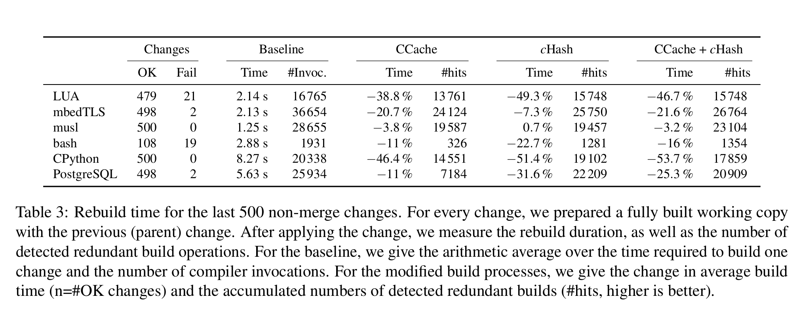

cHash Compiler Plugins and related tools
========================================

Computers should only work if there is work to be done. In the case of
recompiling software, the compiler should only consume precious CPU
time, if the result of this compilation is different from the last
compilation. However, detecting such redundant builds beforehand is
not trivial. Therefore, we can choose various approximations that
spent different quantities of time to this detection:

- GNU make itself detects situations, where no source file has a newer
  timestamp than the resulting object file and avoid the compiler
  invocation at all.
- [CCache](https://ccache.samba.org) calculates a textual hash of the
  preprocessed source code and looks up the hash in an object-file
  cache. Here, at least the C preprocessing has to be done (expand all
  the `#include` statements).
- cHash: We let the compiler proceede even further and wait for the C
  parsing to complete. With a compiler plugin, we interrupt the
  compiler after the parsing, calculate a hash over the abstract
  syntax tree (AST) and decide upon that hash, if we can abort the
  compiler and avoid the costly optimizations.

For more academic information see: https://lab.sra.uni-hannover.de/Research/cHash/

Software Package Requirements
-----------------------------

- clang-6.0-dev
- llvm-6.0-dev
- gcc-6-plugin-dev

The plugin works also with other versions. Please consult and change the CMakeLists.txt file accordingly.

Build the compiler plugins
--------------------------

We use CMake as a build system, and you have to install the compiler
development packages.

    $ mkdir build; cd build
    build/$ cmake ..
    build/$ make clang-hash gcc-hash

In order to run the test-suite, you must use `build` as a directory
and run `./run-tests` from the test folder:

    $ cd test
    $ ./run-tests

In the test-suite, we compare different slighlty different versions of
the test-case according to their object hash and their AST hash.

Provided compiler wrappers
--------------------------

First, you can use `clang-hash` to get AST hashes for a given source file:

    $ build/wrappers/clang-hash example.c
    top-level-hash: c1322e4ca49adfebd59e8e308f56bda2
    processed-bytes: 690
    parse-time-ns: 1418065
    hash-time-ns: 148584
    element-hashes: [("variable:foo", "e71f73274e0043d250a9bc5a0e95cf8c", []), ("function:bar", "34e768d917c149465574c55296681813", []), ("function:main", "323178e57ce8a552d2b70d95132dee6b", ["function:bar", ]), ]

By using `clang-hash-stop`, you can use the redundant-operation
detection. It can be used exactly as `clang` would be invoked. It
hardlinks a copy of the last full compilation and stores the AST hash
in different seperate file.

    $ build/wrappers/clang-hash-stop -c example.c -o example.o
    $ ls example.o*
    example.o
    example.o.hash
    example.o.hash.copy

For a detailed information, use the verbose mode

    $ build/wrappers/clang-hash-stop -c example.c -o example.o -Xclang -plugin-arg-clang-hash -Xclang -hash-verbose
